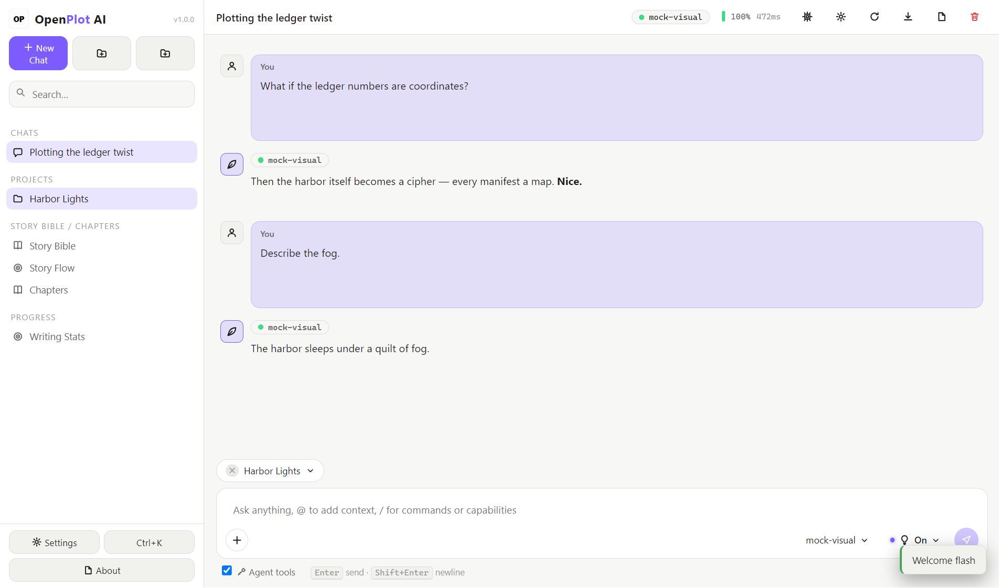
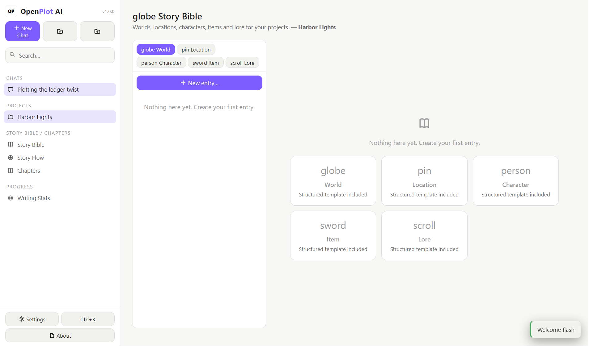
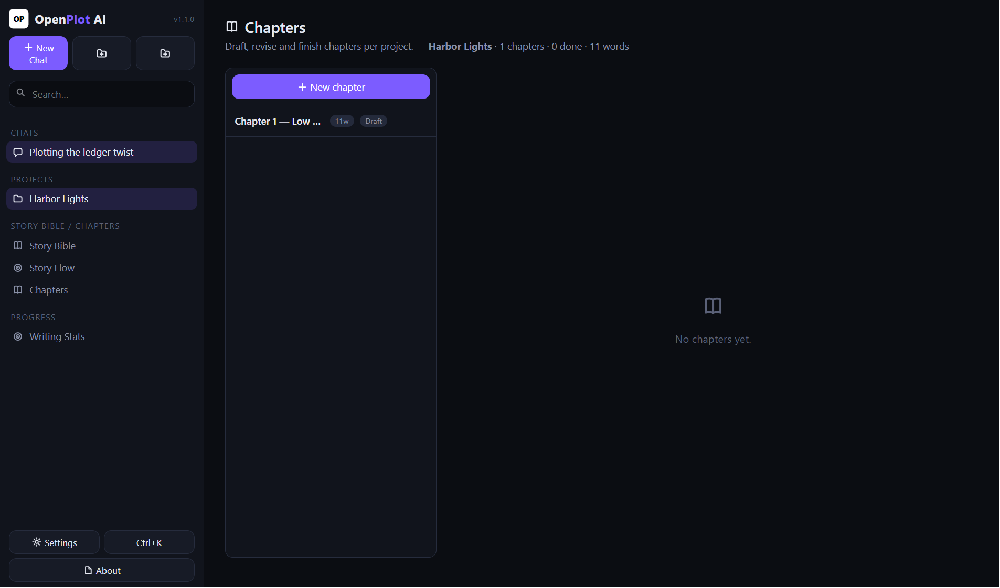
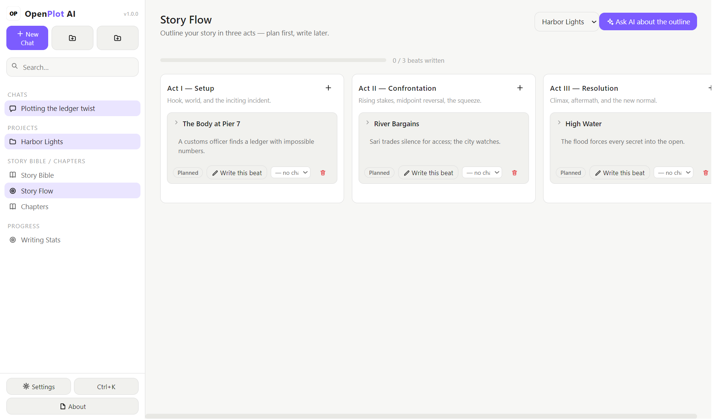
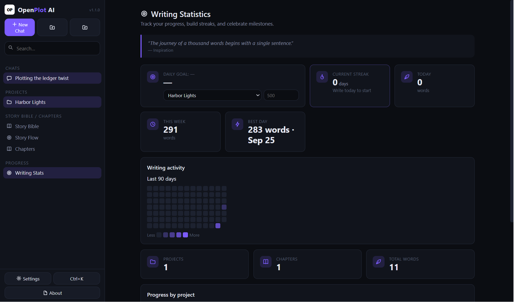
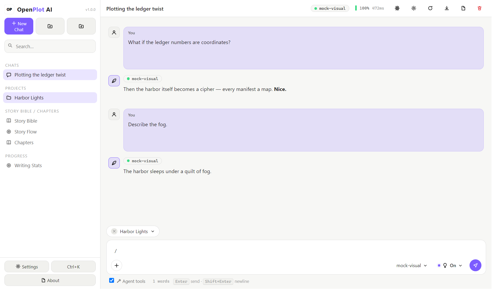

# OpenPlot AI

[](https://github.com/mahakammoonlightstudio-beep/OpenPlot-AI/releases)
[](https://github.com/mahakammoonlightstudio-beep/OpenPlot-AI/actions/workflows/release.yml)
[](LICENSE)
[](https://github.com/mahakammoonlightstudio-beep/OpenPlot-AI/releases)
[](https://github.com/mahakammoonlightstudio-beep/OpenPlot-AI/stargazers)


A local-first AI chat and story-writing studio for Windows, macOS and Linux. **[Website & download](https://mahakammoonlightstudio-beep.github.io/OpenPlot-AI/)**

OpenPlot AI is a desktop application built on Electron, React and SQLite. It connects to any AI provider — OpenAI, Anthropic, OpenRouter, Groq, Ollama, LM Studio, or any OpenAI-compatible `/v1` endpoint — and combines the conversation with a structured writing environment: a story bible, an outline board, chapters, writing statistics and long-term memory. All data is stored locally. There is no account, no cloud service and no telemetry.

The project was formerly known as **InkWell**.

## Screenshots

**Chat** — streaming replies, reasoning display, agent tools, prompt library (`/`), @-mentions of story entries and chapters.



**Story bible** — worlds, locations, characters, items and lore with tags, search and cross-links.



**Chapters** — a per-project editor with statuses, word counts and version history.



**Story flow** — a three-act outline board that can be linked to chapters.



**Statistics** — daily goals, streaks, a 90-day activity heatmap and per-project progress.



**Themes** — ten themes and ten accent colors, with English and Bahasa Indonesia interface languages.



## Features

**Chat**
- Multi-provider, multi-model. Any model from any connected provider can be selected per chat.
- Streaming responses with a reasoning/thinking display (Anthropic extended thinking, DeepSeek-style `reasoning`, `<think>` tags).
- Agent tools: the model can save memories and create, update and search story entries and chapters directly.
- Prompt library with `/` templates and `{placeholder}` substitution.
- @-mentions that expand story-bible entries and chapters into the model context.
- Edit and resend, regenerate, delete, and export a conversation to Markdown.
- A context guard trims the oldest turns from the request when a chat exceeds the configured model context window. Nothing is deleted from the transcript.
- Per-chat overrides: system prompt, temperature, max tokens, top-p, thinking budget, tools and memory toggles, project binding.

**Writing tools**
- Story bible entries with tags and links, full-text search, and per-category counts.
- Chapters with draft/revising/done status, reading-order reordering, focus mode, and a scene board per chapter.
- Chapter version history: snapshots are taken on save, before an AI reply is appended, and before a restore. Any snapshot can be restored or deleted (last 30 kept per chapter).
- One-click AI actions on the open chapter: continue writing, critique, beat outline.
- Writing statistics: daily goal with progress bar, current and best streak, weekly totals, 90-day heatmap, and per-project stakes (1–10) with an AI arc analysis.

**Export**
- Whole-project export to Markdown, plain-text manuscript, or EPUB (assembled in the main process, no external dependencies).
- Per-chat Markdown export.

**Organization**
- Projects bind chats, story bible, chapters and statistics together.
- Collapsible folders for chats, full-text chat search, command palette (`Ctrl/Cmd+K`).

**Extensibility**
- `agent.md` instructions injected into every chat.
- Skill packs, sandboxed JavaScript plugins with lifecycle hooks, when/then automations, and an MCP server registry. See [docs/PLUGIN_API.md](docs/PLUGIN_API.md).

**Privacy and storage**
- All data lives in a local SQLite database in the OS user-data directory.
- API keys are encrypted at rest with the OS credential vault (DPAPI, Keychain or libsecret) when available.
- Memories — manual and agent-saved — are visible and deletable in Settings; a single action clears all of them.

## Downloads

Prebuilt binaries for v1.0.2 are attached to the [GitHub releases](https://github.com/mahakammoonlightstudio-beep/OpenPlot-AI/releases). Two packaging styles are provided for each platform:

- **Full app** — a single installer or self-contained file. Install (or run) and the app appears in the usual place for your system.
- **Folder** — a compressed archive containing the application directory. Extract it anywhere and run the binary inside; useful for portable setups and systems without installer permissions.

| Platform | Full app | Folder |
| --- | --- | --- |
| Windows | `OpenPlot.AI.Setup.1.0.2.exe` (NSIS installer) | `OpenPlot.AI-1.0.2-win.zip` |
| macOS | `OpenPlot.AI-1.0.2-universal.dmg` (universal) | `OpenPlot.AI-1.0.2-universal-mac.zip` (universal) / `OpenPlot.AI-1.0.2-arm64-mac.zip` (Apple silicon) |
| Linux | `OpenPlot.AI-1.0.2.AppImage` | `openplot-ai-1.0.2.tar.gz` |

The macOS disk image and the main macOS zip are universal binaries containing both Intel and Apple silicon builds; the `arm64-mac.zip` remains available for a smaller Apple silicon-only download. Older assets for v1.0.0 and v1.0.1 stay attached to their releases.

Releases are built automatically by GitHub Actions on tagged commits.

## Building from source

Requirements: Node.js 18 or newer and npm.

```bash
npm install          # install dependencies
npm run dev          # development (Vite + Electron, hot reload)
npm run typecheck    # TypeScript, no emit
npm run build        # build renderer and main process
npm start            # run the built app

npm run dist:win     # Windows NSIS + zip
npm run dist:linux   # Linux AppImage + tar.gz
npm run dist:mac     # macOS dmg + zip
```

DevTools do not open automatically in development; set `OPENPLOT_DEVTOOLS=1` to enable them.

## Connecting a provider

1. Open **Settings → AI Providers → Add provider**.
2. Set the base URL:

| Provider | Base URL |
| --- | --- |
| OpenAI | `https://api.openai.com/v1` |
| Anthropic | `https://api.anthropic.com/v1` |
| OpenRouter | `https://openrouter.ai/api/v1` |
| Ollama | `http://localhost:11434/v1` |
| LM Studio | `http://localhost:1234/v1` |
| Groq | `https://api.groq.com/openai/v1` |

3. Paste the API key, run **Fetch models**, then select a model in the chat header.

Ollama and LM Studio need no API key. The key validator treats a `404 model not found` response from the model list as a valid key, so hosted gateways that reject probe models are handled correctly.

## Keyboard shortcuts

| Shortcut | Action |
| --- | --- |
| `Ctrl/Cmd+N` | New chat |
| `Ctrl/Cmd+Shift+N` | New project |
| `Ctrl/Cmd+S` | Save the open chapter |
| `Ctrl/Cmd+K` | Command palette |
| `Ctrl/Cmd+,` | Settings |
| `Escape` | Exit focus mode / close menus |

## Data and privacy

The database is stored at the OS user-data path (`%APPDATA%/openplot-ai` on Windows, `~/Library/Application Support/openplot-ai` on macOS, `~/.config/openplot-ai` on Linux). Uninstalling the application does not remove the database. **Settings → Data** can reset everything, including memories, story content and chapters.

## Project structure

```
electron/          main process: database, AI engine, tools, plugins, IPC
src/               React renderer
  components/      ChatView, StoryBibleView, ChaptersView, SettingsView, ...
docs/              plugin API reference, stress test notes, original README
scripts/           engine, GUI and end-to-end test scripts
```

## Documentation

- [Changelog](CHANGELOG.md)
- [Plugin API](docs/PLUGIN_API.md)
- [Stress test notes](docs/STRESS_TEST.md)
- [Original README variant](docs/README-original.md)

## License

[MIT](LICENSE) — Mahakam Moonlight Studio.

## Support

Development is funded through [SociaBuzz](https://sociabuzz.com/mahakam_moonlight_studio/tribe) and [Saweria](https://saweria.co/MahakamMoonStudio).
